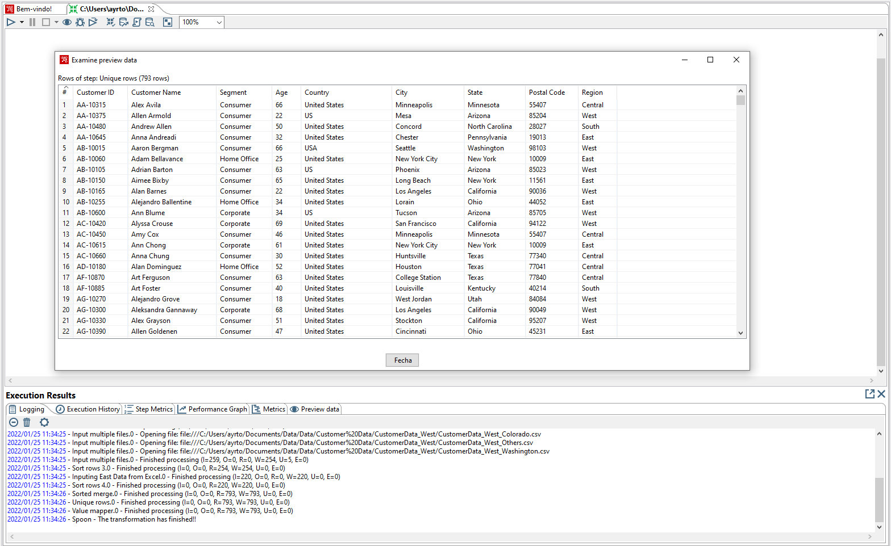
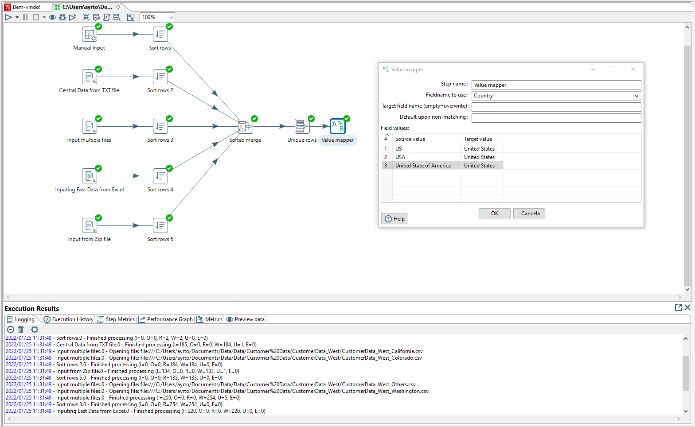

# Pentaho-studies - Data Cleasing

---
### Passo 1 - Mapeando os valores
Nessa primeira etapa, vamos começar a organizar alguns dados para que não aconteça ambiguidade, onde, na coluna 'Country' temos o caso de várias repetições de um nome que tem o mesmo significado, podendo ser transformado em um único valor.

   
   
   

---
<h4 align="center">
    Feito com :blue_heart: por Ayrton Cossuol
</h4>
