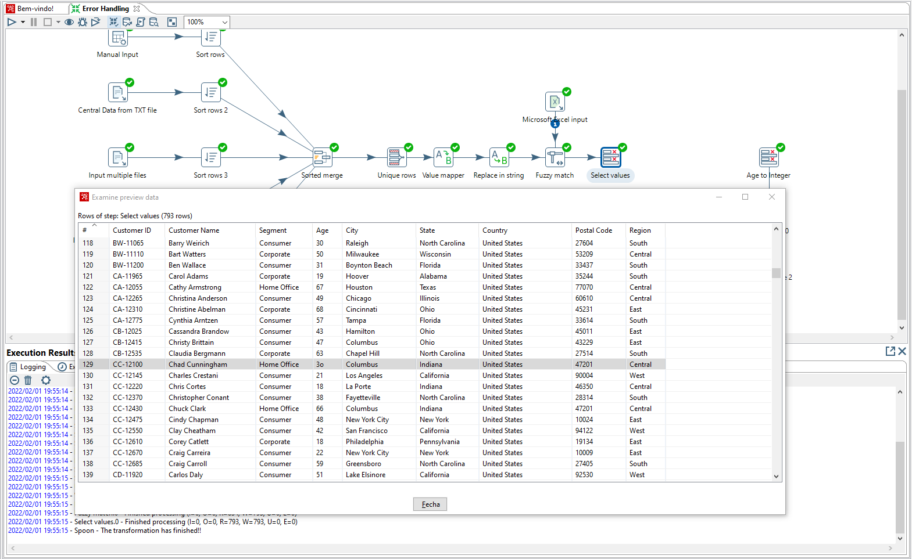
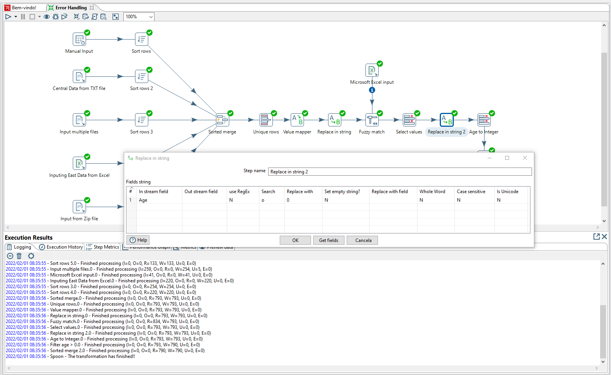
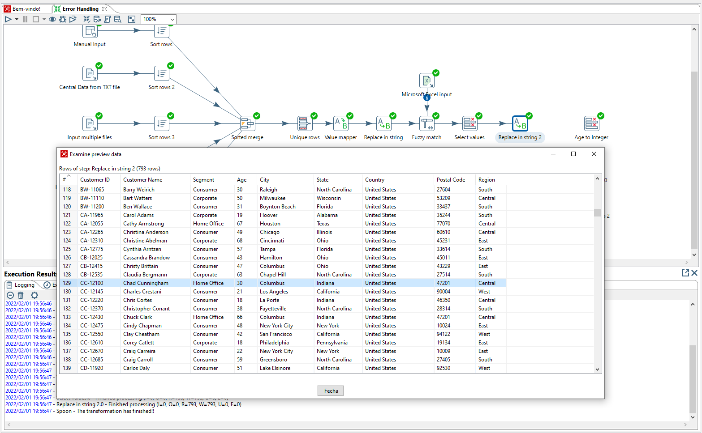
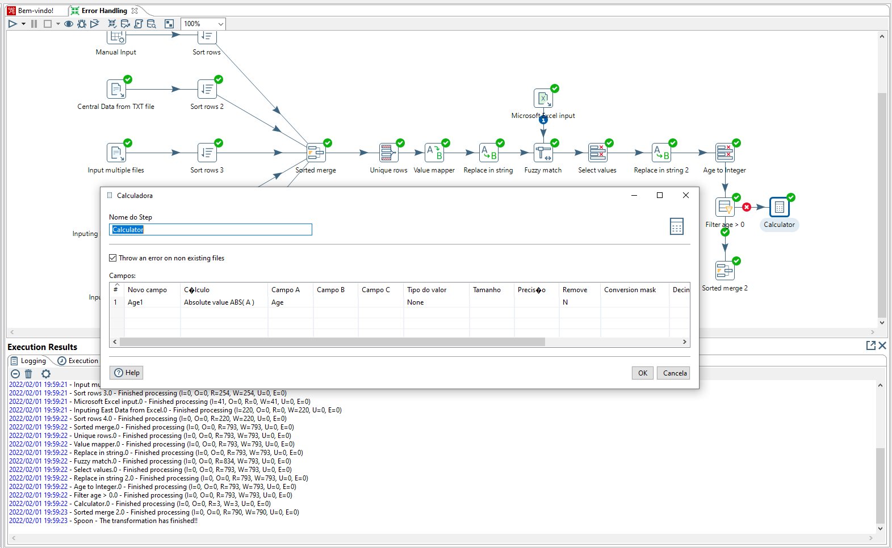
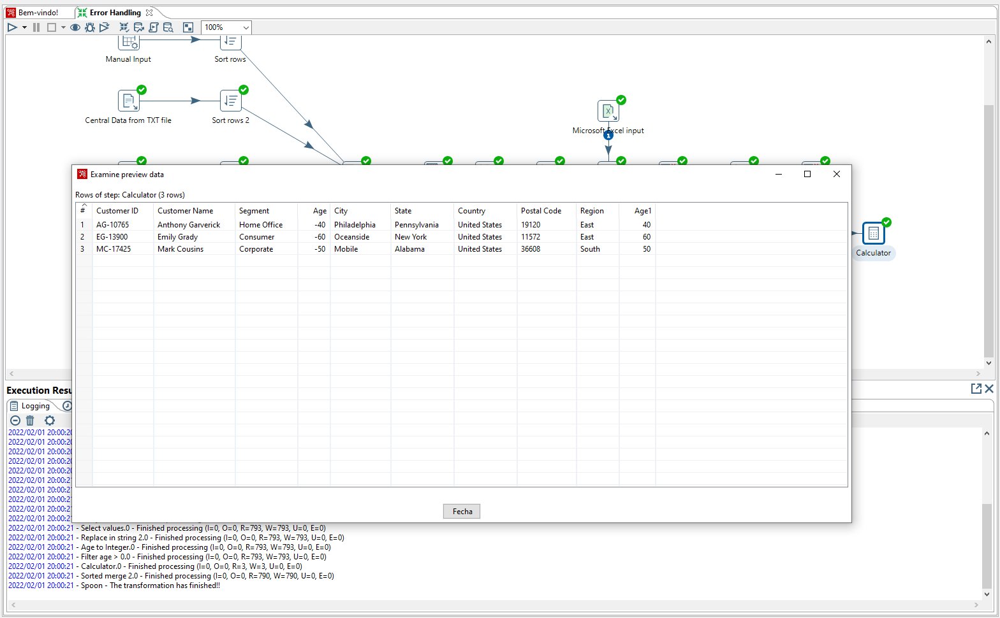
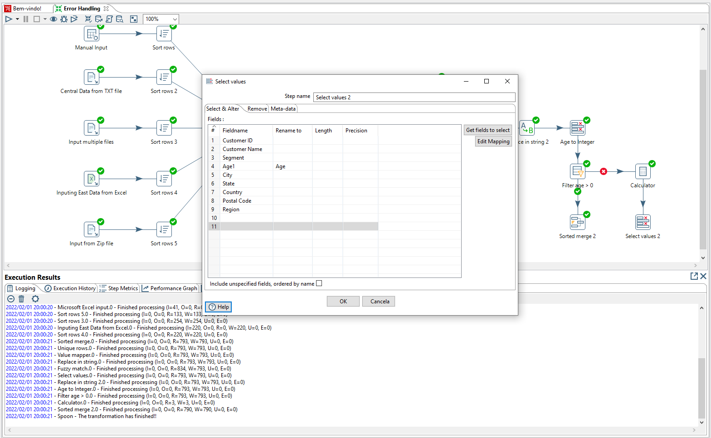
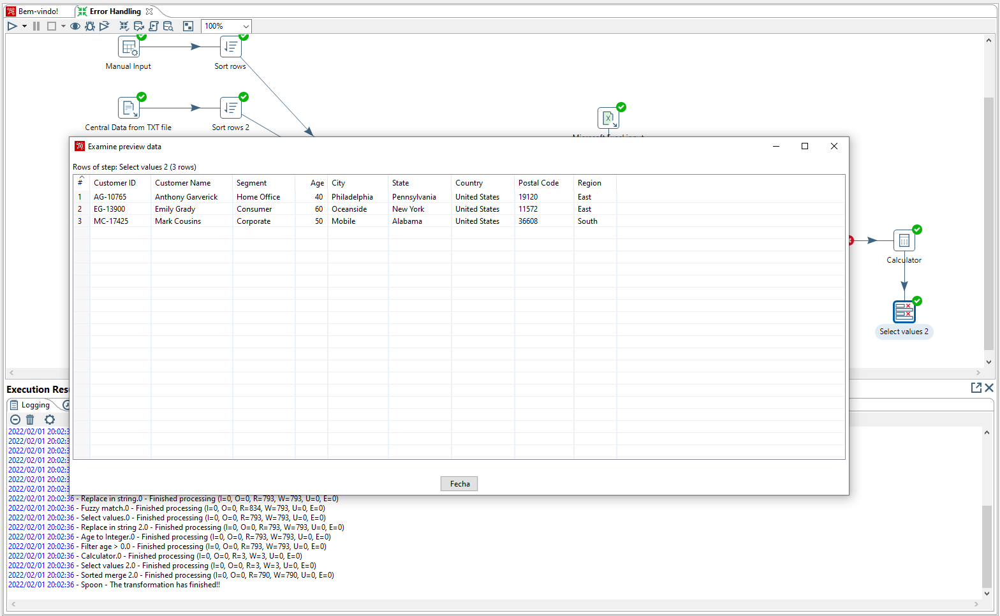
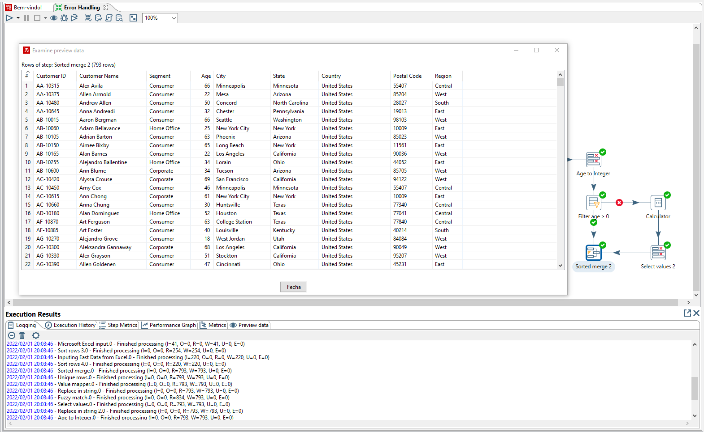

# Pentaho-studies - Error Handling

Nesta etapa vamos fazer a parte da correção de alguns registros que não estão fazendo sentido em nossa base, visto que há letras misturadas com números no campo de Idade e também valores negativos.

---
### Passo 1 - Correção dos registros
Aqui vamos fazer a troca da string 'o' presente no campo Age pelo número 0 e depois o tratamento dos números negativos. Após todo esse passo a passo, vamos unificar a base sem perda de nenhum registro.

   
   
   
   
   
   
   
   

---
<h4 align="center">
    Feito com :blue_heart: por Ayrton Cossuol
</h4>
