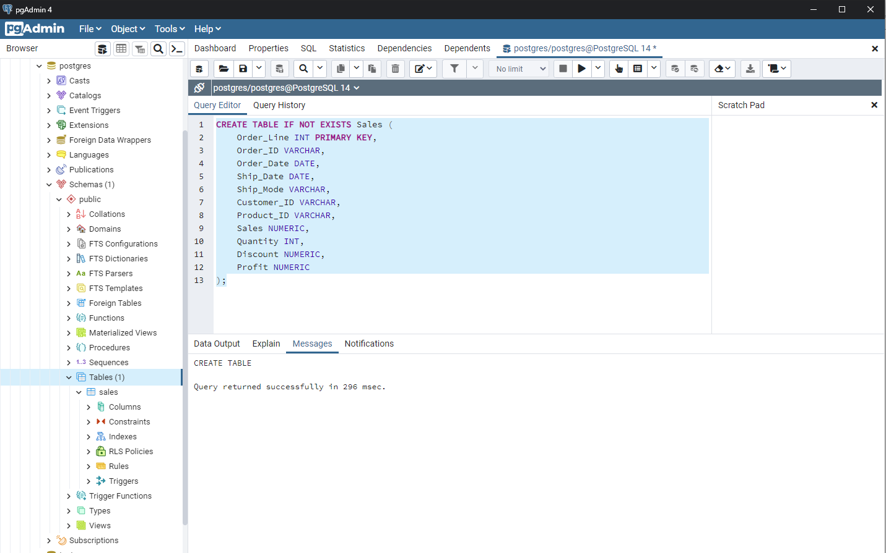
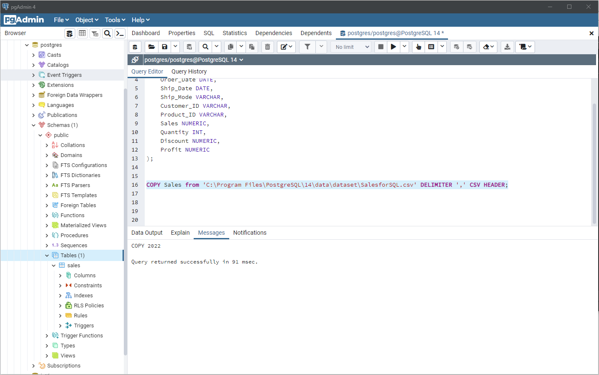
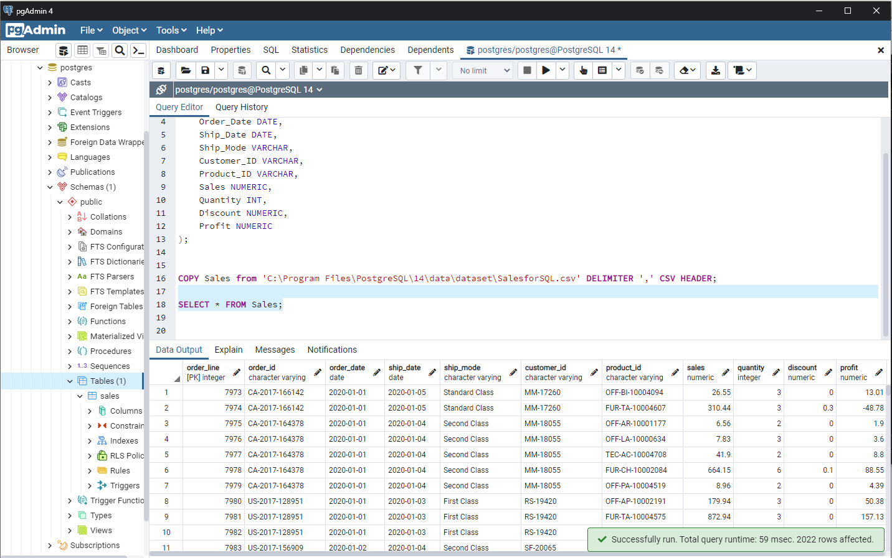
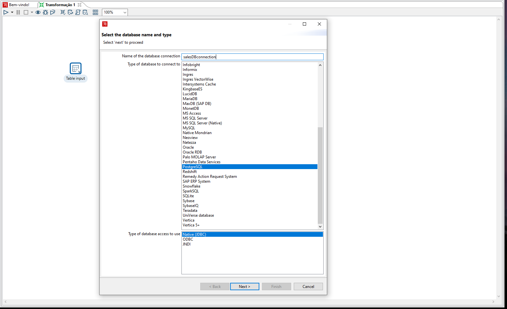
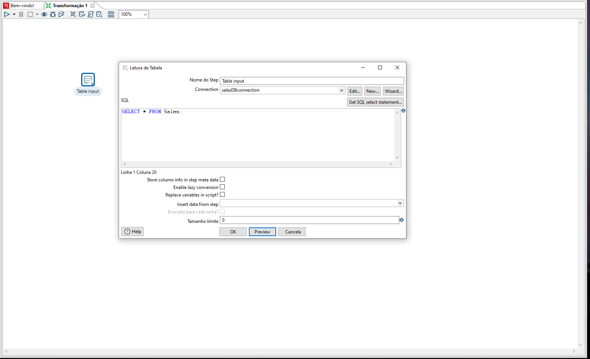
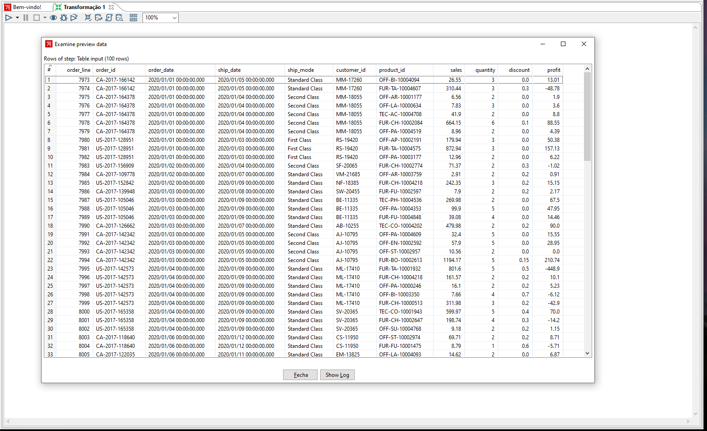

# Pentaho-studies - Input table from PostgresSQL

Nesta parte, vamos fazer a captura dos dados vinda de uma tabela no ambiente do PostgresSQL, por meio de uma query simples, vamos fazer toda a captura dos dados que estão na tabela Sales.

---
### Passo 1 - Criação da tabela no PostgresSQL
Vamos fazer a criação da tabela com os registros utilizando uma base de dados presente em nosso diretório.

   
   
   

---
### Passo 2 - Captura dos dados 
Com o Table Input, vamos fazer toda a conexão com o PostgresSQL para capturar os dados.

   
   
   

---
<h4 align="center">
    Feito com :blue_heart: por Ayrton Cossuol
</h4>
