# Pentaho-studies - PDI SQL Connection
Neste módulo, vamos praticar a conexão do Pentaho com o banco de dados PostgreSQL, fazendo as operações mais simples com o banco, como inserir registros, modificar e deletar.

---
### Passo 0 - Criando os registros no banco de dados PostgreSQL
Nessa etapa inicial, vamos fazer a criação da tabela 'science_class' dentro da Database padrão do postgres e inserir alguns registros.

   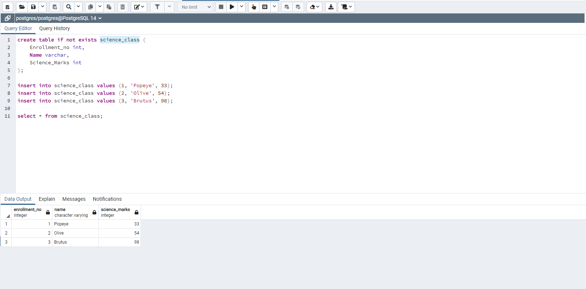

---
### Passo 1 - Conexão PDI / PostgresSQL
Agora, vamos fazer toda a parte da conexão com os dados presentes no Postgres.

   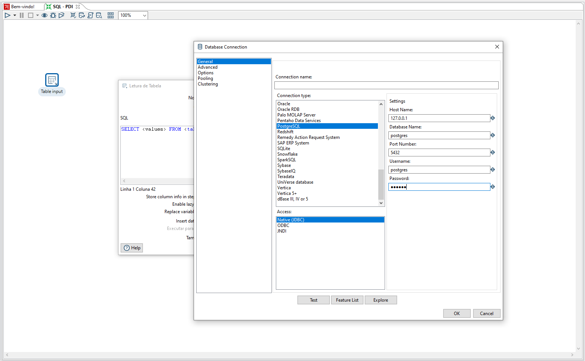
   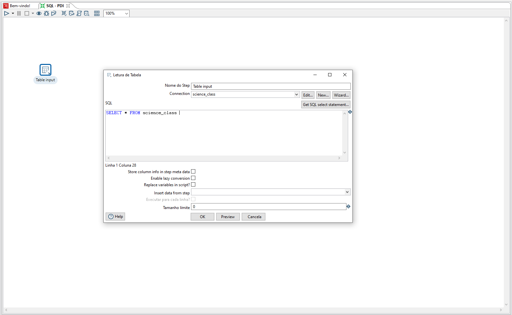
   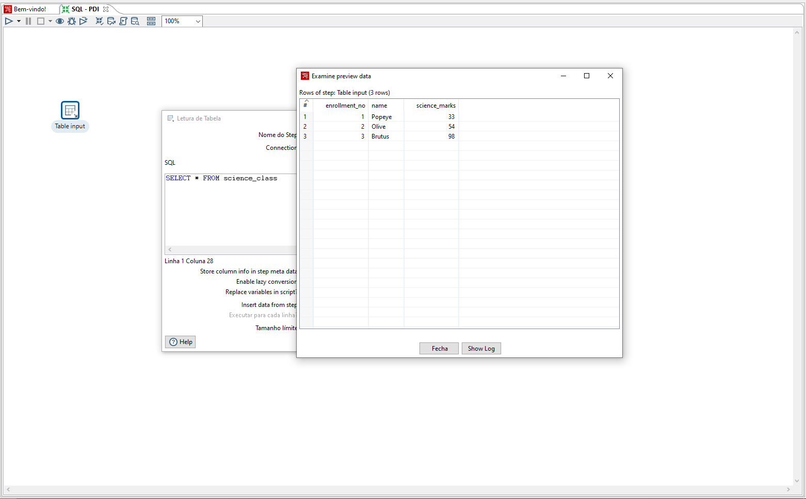
   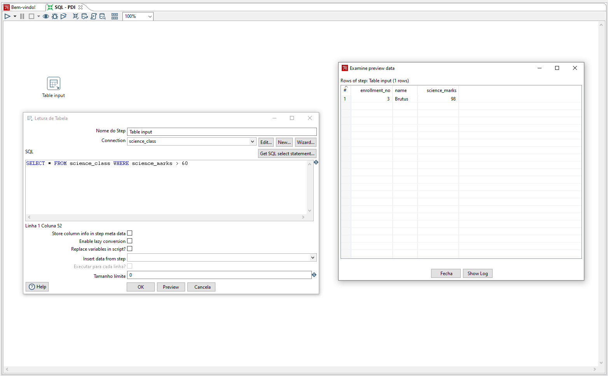

---
### Passo 2 - Inserindo e Atualizando Registros
Aqui, vamos fazer algumas atualizações nos registros já presentes e também uma inclusão de um registro novo.

   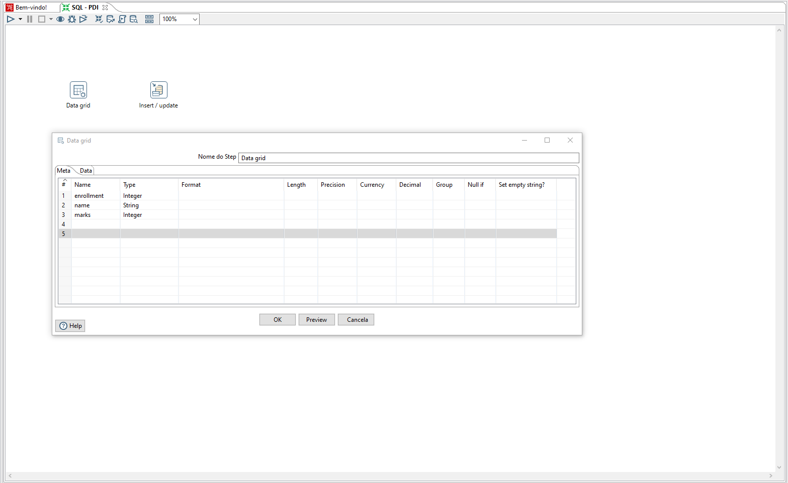
   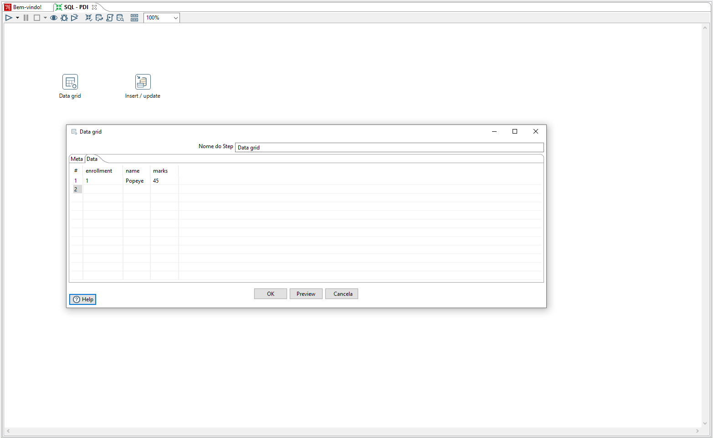
   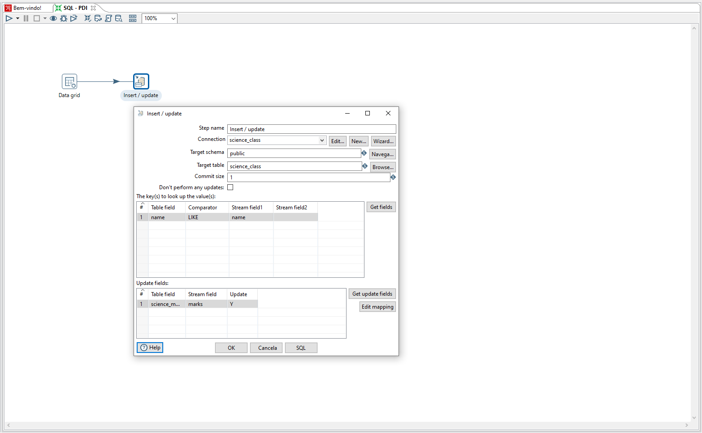
   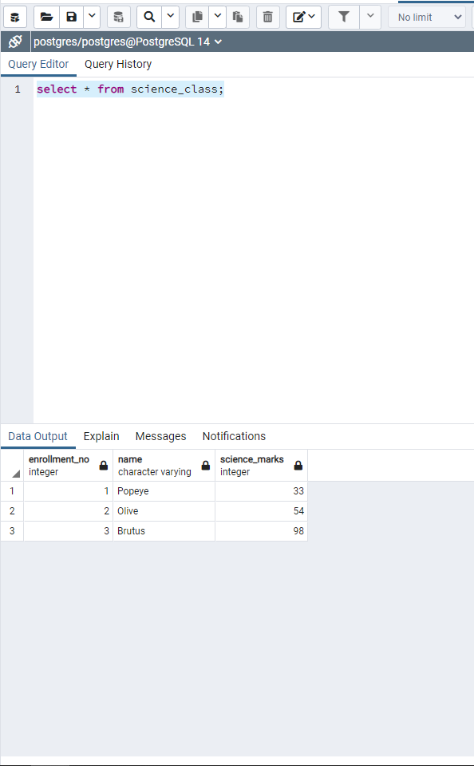
   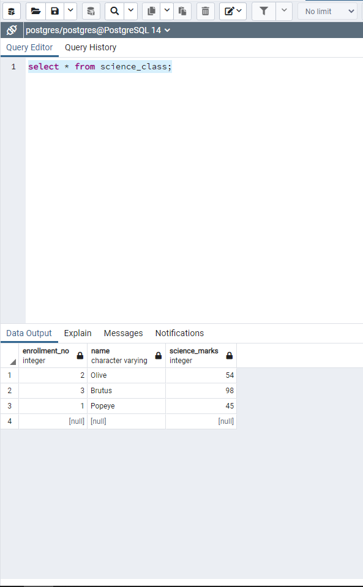
   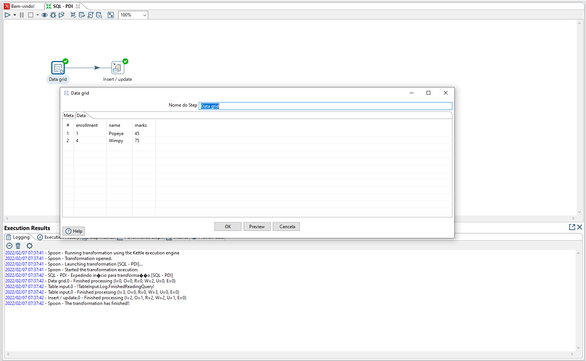
   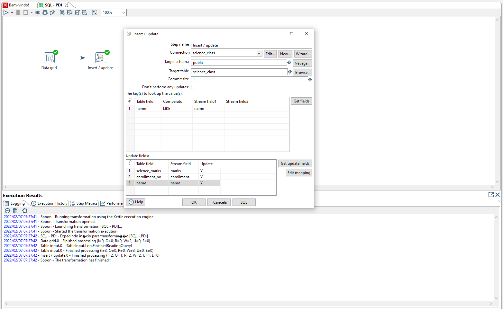
   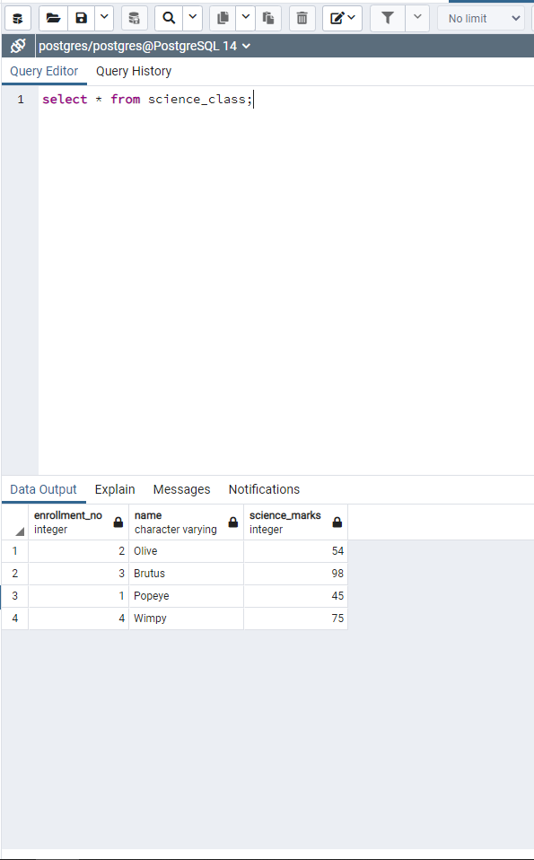
   

---
### Passo 3 - Deletando registros da tabela no Postgres
Por fim, vamos mostrar um caso de excluir um registro da tabela.

   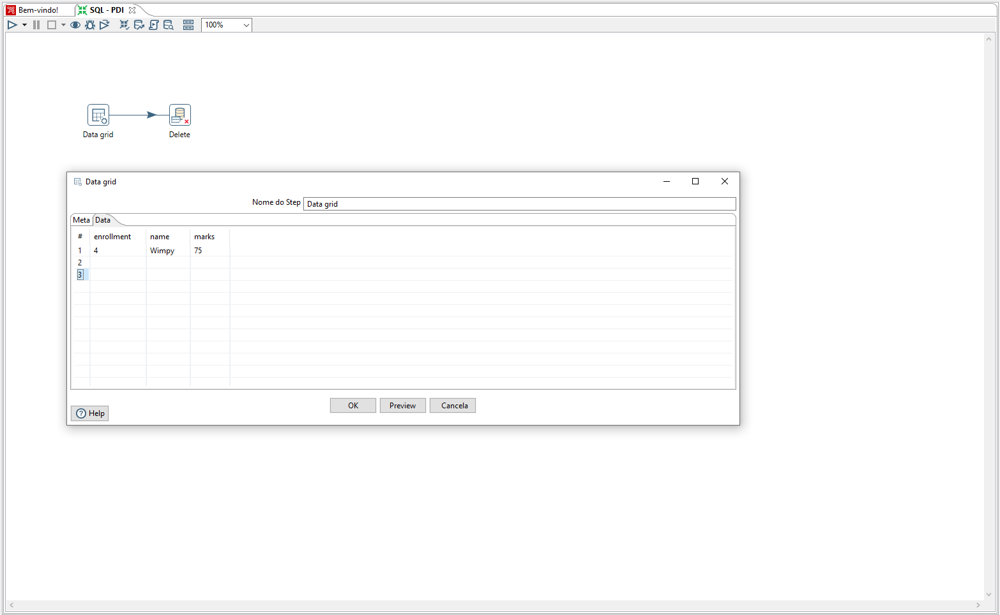
   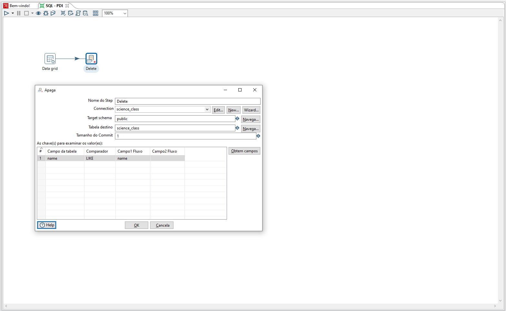
   
   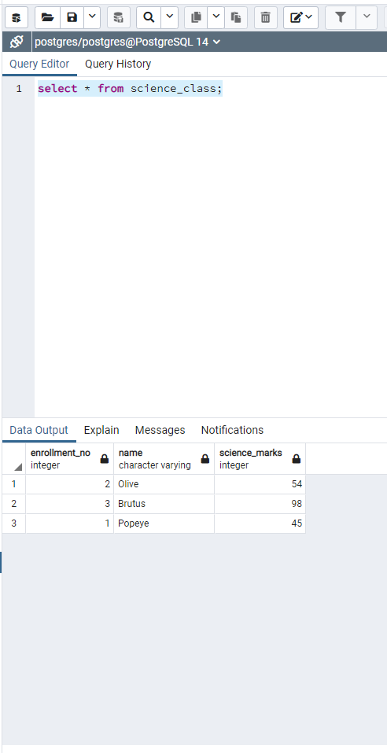

---
<h4 align="center">
    Feito com :blue_heart: por Ayrton Cossuol
</h4>
