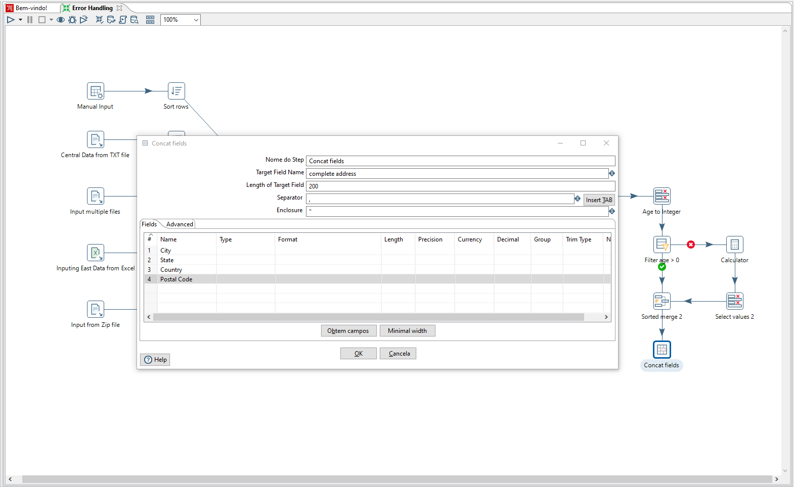
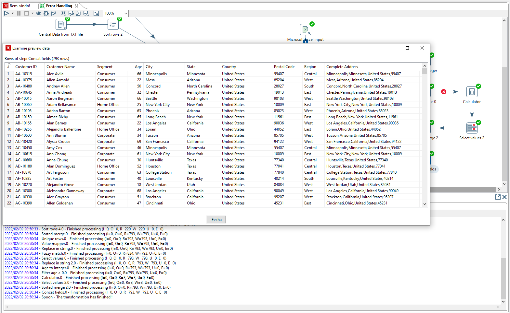
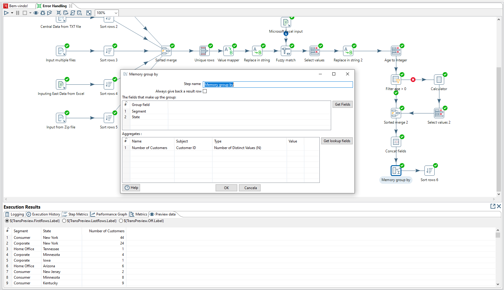
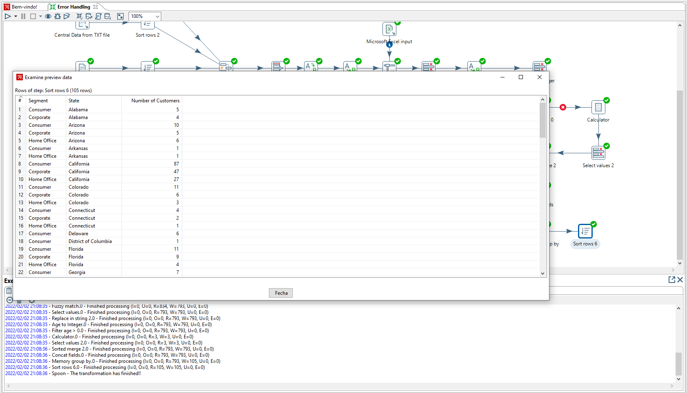
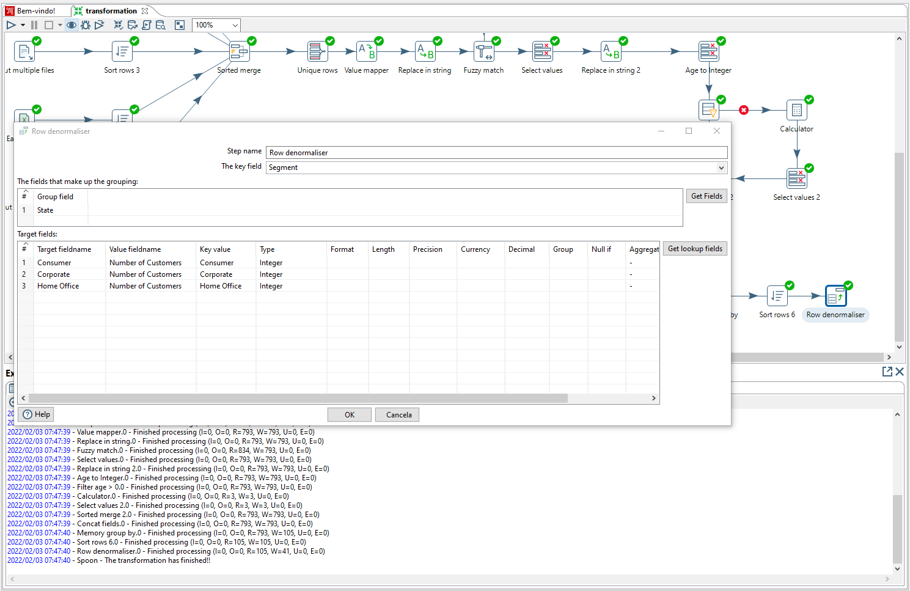
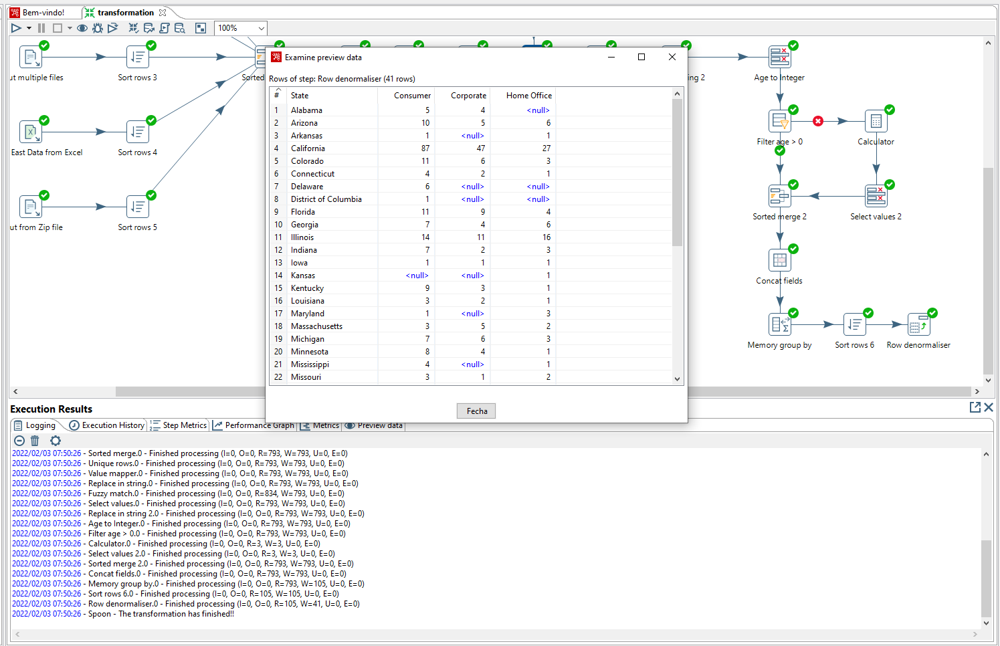

# Pentaho-studies - Transformation and Analytics Steps

Neste módulo, vamos fazer a criação de novas colunas com a possibilidade de concatenação de informações já presentes em nossa tabela. E também a facilidade de fazer algumas pesquisas de quantidades por determinado filtro.

---
### Passo 1 - Concatenando o Endereço
Aqui, vamos utilizar as informações já presentes na base para gerar um campo com a informação completa do endereço.

   
   

---
### Passo 2 - Agregando com o Group-by
Pensando agora nessa parte, onde podemos fazer um cálculo da quantidade de 'Customers' em relação ao 'State' e ao 'Segment'.

   
   

---
### Passo 3 - Desnormalizando
Nesse passo, vamos fazer a diferente a forma de visualizar as quantidade 'Consumer', 'Corporate' e 'Home Office' em relação aos 'State' presentes na base.

   
   

---
<h4 align="center">
    Feito com :blue_heart: por Ayrton Cossuol
</h4>
